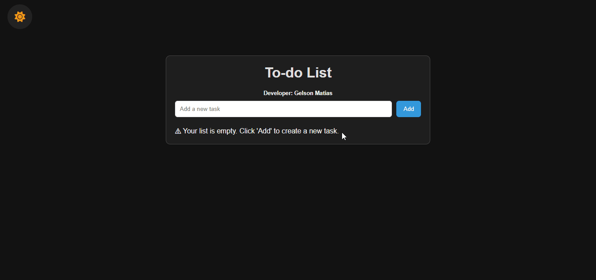

# Web App Todo-List

[](./LICENSE)


A simple web application for managing tasks.

---

## 🎥 Preview

Here’s a preview of the application:

  

---

## 🚀 Technologies
- **HTML**  
- **CSS**  
- **JavaScript**

## 👨‍💻 Author
Created by **Gelson D. J. Matias**.

## 📦 How to Run the Project
1. Download or clone this repository:  
   ```bash
   git clone https://github.com/GelsonDJMatias/todo-list.git
